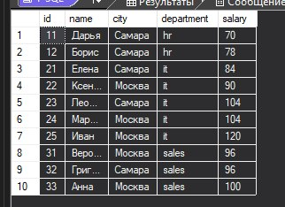
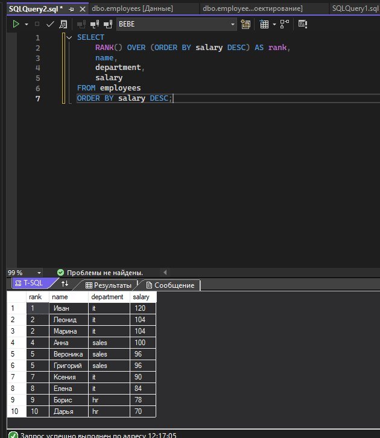
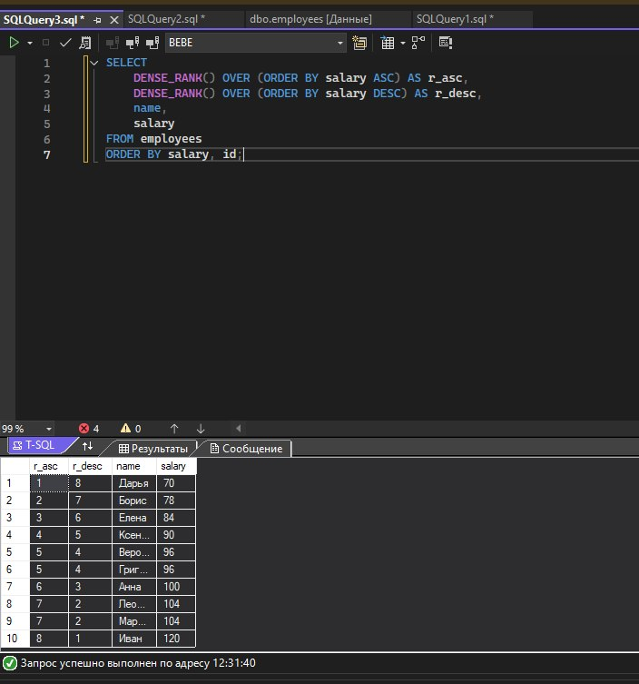
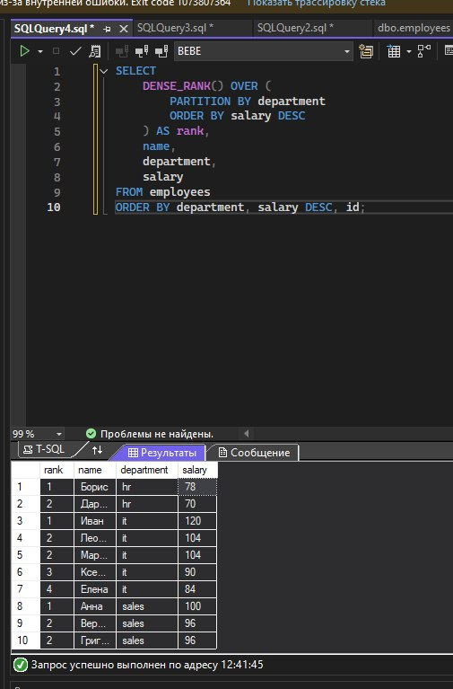
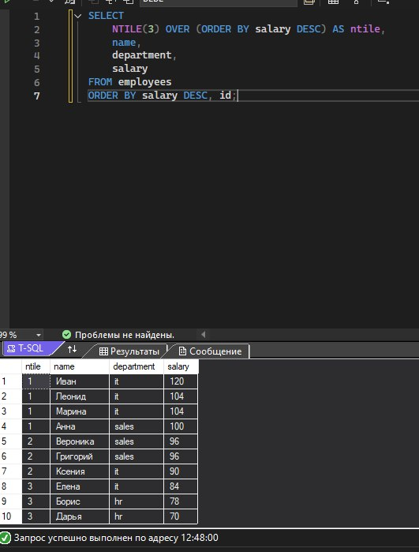

Создание таблицы
```sql
CREATE TABLE employees (
    id INT PRIMARY KEY,
    name NVARCHAR(50),
    city NVARCHAR(50),
    department NVARCHAR(50),
    salary INT
);

INSERT INTO employees (id, name, city, department, salary)
VALUES
(11, N'Дарья', N'Самара', N'hr', 70),
(12, N'Борис', N'Самара', N'hr', 78),
(21, N'Елена', N'Самара', N'it', 84),
(22, N'Ксения', N'Москва', N'it', 90),
(23, N'Леонид', N'Самара', N'it', 104),
(24, N'Марина', N'Москва', N'it', 104),
(25, N'Иван', N'Москва', N'it', 120),
(31, N'Вероника', N'Москва', N'sales', 96),
(32, N'Григорий', N'Самара', N'sales', 96),
(33, N'Анна', N'Москва', N'sales', 100);
```

```sql
SELECT * FROM employees;
```



```sql
SELECT
    RANK() OVER (ORDER BY salary DESC) AS rank,
    name,
    department,
    salary
FROM employees
ORDER BY salary DESC;
```

```sql
RANK() OVER (ORDER BY salary DESC)
```



```sql
SELECT
    DENSE_RANK() OVER (ORDER BY salary ASC) AS r_asc,
    DENSE_RANK() OVER (ORDER BY salary DESC) AS r_desc,
    name,
    salary
FROM employees
ORDER BY salary, id;
```


```sql
SELECT
    DENSE_RANK() OVER (
        PARTITION BY department
        ORDER BY salary DESC
    ) AS rank,
    name,
    department,
    salary
FROM employees
ORDER BY department, salary DESC, id;
```





```sql
SELECT
    NTILE(3) OVER (ORDER BY salary DESC) AS ntile,
    name,
    department,
    salary
FROM employees
ORDER BY salary DESC, id;
```

разделение на три группы по зп


