# Конспект

# Microsoft SQL Server

**Microsoft SQL Server** — это корпоративная реляционная СУБД, построенная по клиент-серверной архитектуре.

Для взаимодействия с БД применяется язык **T-SQL (Transact-SQL)**.

## Как работает клиент-серверная архитектура

1. Клиент отправляет запрос.
2. Сервер принимает обращение и выполняет поставленную задачу.
3. Программно-аппаратный комплекс отправляет клиенту результат выполненной работы и обработанного запроса.

### БД и экземпляр сервера

- **БД (база данных)** — часть экземпляра сервера.
- **Экземпляр сервера** — установленный и работающий экземпляр Microsoft SQL Server, который может содержать несколько баз данных.

---

# 1. Microsoft SQL Server

## Возможности СУБД

Система управления базами данных предоставляет:

- интерфейсы для работы с базой данных;
- физическую и логическую независимость данных;
- оптимизацию запросов;
- обеспечение целостности данных;
- поддержку одновременной работы нескольких пользователей;
- резервное копирование и восстановление;
- механизмы безопасности.

## Аутентификация и авторизация

**Аутентификация** — проверка того, кто пытается получить доступ к системе.

**Авторизация** — определение того, какие действия разрешены пользователю после успешной аутентификации.

---

# 1.1. Создание БД

База данных является частью экземпляра сервера.

Один экземпляр SQL Server может содержать несколько баз данных.

При создании базы данных задаются параметры файлов базы данных, например:

- логическое имя файла;
- физическое имя и путь;
- начальный размер;
- максимальный размер;
- шаг увеличения файла;
- принадлежность к файловой группе.

---

# 1.2. Системные требования

Для работы SQL Server учитываются:

- объём оперативной памяти;
- свободное место на диске;
- версия и разрядность Windows;
- сетевые требования.

В материалах лекции указано минимальное требование по памяти — **512 МБ**.

SQL Server поддерживает Windows в 32- и 64-разрядных вариантах в зависимости от версии/редакции.

---

# 1.3. Редакции Microsoft SQL Server

В материалах представлены следующие редакции:

### Express

Бесплатная редакция SQL Server.

Подходит для небольших приложений, обучения и разработки.

### Workgroup

Редакция для небольших организаций и рабочих групп.

### Standard

Стандартная редакция для обычных серверных задач и корпоративных приложений.

### Web

Редакция, ориентированная на веб-хостинг.

### Enterprise

Расширенная редакция для крупных корпоративных систем.

### Developer

Редакция для разработки и тестирования.

### Datacenter

Редакция для высоконагруженных систем и центров обработки данных.

### Parallel Data Warehouse

Специализированная редакция для работы с большими объёмами данных и параллельной обработкой.

---

# 1.4. Компоненты SQL Server

Основные компоненты:

- **Database Engine** — ядро СУБД, работа с базами данных и запросами.
- **Analysis Services** — аналитические службы.
- **Reporting Services** — службы формирования и предоставления отчётов.
- **Integration Services** — службы интеграции и обработки данных.
- **Full-Text Search** — полнотекстовый поиск.
- **SQL Server Agent** — служба автоматизации заданий.
- **SQL Server Browser** — служба обнаружения экземпляров SQL Server.

---

# 1.5. Экземпляры SQL Server

SQL Server может работать с:

- экземпляром по умолчанию;
- именованным экземпляром.

Экземпляр позволяет установить и использовать несколько независимых экземпляров SQL Server на одном компьютере.

---

# 1.6. Аутентификация SQL Server

Используются два основных режима:

### Windows Authentication

Для входа используются учётные данные Windows.

### SQL Server Authentication

Для входа используются отдельные учётные данные SQL Server — имя пользователя и пароль.

---

# 2. Базы данных SQL Server

Базы данных можно разделить на:

- системные;
- пользовательские.

## Системные базы данных

Системные базы данных создаются во время установки SQL Server и используются самим сервером.

Основные системные базы:

- `master`
- `model`
- `msdb`
- `tempdb`
- `Resource`

### master

Содержит основные сведения о конфигурации SQL Server, экземплярах и базах данных.

### model

Используется как шаблон при создании новых баз данных.

### msdb

Используется SQL Server Agent и другими компонентами для хранения информации о заданиях и связанных объектах.

### tempdb

Используется для временных объектов и промежуточных результатов работы SQL Server.

### Resource

Содержит системные объекты SQL Server.

---

# 3. Хранение данных

База данных хранится в одном или нескольких файлах.

Файлы базы данных разделяются на страницы.

## Страница

**Page (страница)** — основная единица хранения данных в SQL Server.

Размер страницы:

**8 КБ (8192 байта).**

У страницы имеется заголовок размером **96 байт**.

После заголовка располагается область данных.

Страницы используются для хранения:

- данных;
- индексов;
- других структур SQL Server.

## Идентификация страницы

Страница идентифицируется по:

- ID базы данных;
- ID файла;
- номеру страницы.

---

# 3.1. Extent

**Extent** — физическая единица выделения пространства на диске.

Один extent состоит из:

**8 страниц × 8 КБ = 64 КБ.**

Существуют:

- однородные (uniform) extents;
- смешанные (mixed) extents.

Однородный extent принадлежит одному объекту.

Смешанный extent может использоваться несколькими объектами.

---

# 3.2. Структура страницы

Страница содержит:

1. заголовок;
2. строки/данные;
3. служебную информацию.

Заголовок страницы содержит информацию, необходимую SQL Server для работы со страницей.

Размер заголовка — **96 байт**.

В SQL Server существуют различные типы страниц, например страницы данных и страницы индексов.

---

# 3.3. Строки данных

Данные таблиц хранятся в строках.

Строки располагаются на страницах.

При организации строк учитывается их размер и структура.

Используются столбцы:

- фиксированной длины;
- переменной длины.

---

# 3.4. Файлы базы данных

База данных может состоять из одного или нескольких файлов.

Основные типы:

### `.mdf`

Основной файл данных базы.

### `.ndf`

Дополнительный файл данных.

### `.log`

Файл журнала транзакций.

Журнал транзакций используется для регистрации изменений и восстановления базы данных после сбоев.

При создании базы данных сначала создаётся файл журнала транзакций, а затем файл данных.

---

# 3.5. Filegroup

**Filegroup (файловая группа)** — логическая группа файлов базы данных.

Файлы базы данных могут объединяться в файловые группы.

Файловые группы позволяют логически организовывать размещение данных.

---

# 4. CREATE DATABASE

Для создания базы данных используется команда `CREATE DATABASE`.

Пример:

```sql
CREATE DATABASE TestDB
ON
(
    NAME = TestDB_Data,
    FILENAME = 'C:\SQL\TestDB.mdf',
    SIZE = 10MB,
    MAXSIZE = 100MB,
    FILEGROWTH = 10MB
)
LOG ON
(
    NAME = TestDB_Log,
    FILENAME = 'C:\SQL\TestDB.ldf',
    SIZE = 5MB,
    MAXSIZE = 50MB,
    FILEGROWTH = 5MB
);
```

## Основные параметры

### NAME

Логическое имя файла.

### FILENAME

Физическое имя и расположение файла.

### SIZE

Начальный размер файла.

### MAXSIZE

Максимальный размер файла.

### FILEGROWTH

Шаг увеличения файла.

---

# 5. ALTER DATABASE

Команда `ALTER DATABASE` используется для изменения параметров существующей базы данных.

С её помощью можно:

- добавлять файловые группы;
- добавлять файлы;
- изменять параметры базы данных;
- задавать различные настройки работы базы.

Пример добавления файловой группы:

```sql
ALTER DATABASE TestDB
ADD FILEGROUP FG_Data;
```

Пример изменения параметров:

```sql
ALTER DATABASE TestDB
SET AUTO_CLOSE OFF;
```

---

# 5.1. Параметры базы данных

В материалах рассматриваются, в частности:

### AUTO_CLOSE

Определяет, будет ли база данных автоматически закрываться после завершения работы с ней.

### AUTO_CREATE_STATISTICS

Определяет автоматическое создание статистики, используемой оптимизатором запросов.

### AUTO_SHRINK

Определяет автоматическое уменьшение размера файлов базы данных.

---

# 6. Логическая схема базы данных

Логическая схема может рассматриваться с разных точек зрения:

- администратора;
- разработчика/проектировщика;
- пользователя.

Разные уровни представления обеспечивают независимость данных.

## Независимость данных

Выделяются уровни независимости:

- физическая;
- логическая;
- представление данных для пользователей.

Изменения на одном уровне по возможности не должны требовать изменений на других уровнях.

---

# 7. Работа с таблицами

## Удаление таблицы

Для удаления таблицы используется:

```sql
DROP TABLE TableName;
```

Удаление может не выполниться, если на таблицу ссылаются другие объекты, например ограничения или зависимости.

## Изменение структуры таблицы

Для изменения существующей таблицы используется:

```sql
ALTER TABLE
```

С помощью `ALTER TABLE` можно изменять структуру таблицы.

---

# 8. Системный каталог

SQL Server хранит сведения об объектах базы данных в системном каталоге.

Для просмотра информации используются системные представления.

Например:

### sys.objects

Содержит сведения об объектах базы данных.

### sys.columns

Содержит сведения о столбцах объектов.

### sys.database_principals

Содержит сведения о принципалах безопасности базы данных.

---

# 8.1. Представления для получения информации

Для получения информации о структуре базы данных могут использоваться:

- системные представления;
- динамические административные представления и функции;
- Information Schema.

Динамические административные представления и функции используются для получения сведений о состоянии и работе SQL Server.

---

# 8.2. Системные хранимые процедуры

В материалах рассматриваются:

### sp_help

Используется для получения информации об объекте.

Пример:

```sql
EXEC sp_help 'TableName';
```

### sp_configure

Используется для просмотра и настройки параметров SQL Server.

Пример:

```sql
EXEC sp_configure;
```

---

# 8.3. Системные функции

В SQL Server используются функции для получения информации об объектах и базе данных.

### OBJECT_ID

Возвращает идентификатор объекта.

```sql
SELECT OBJECT_ID('TableName');
```

### OBJECT_NAME

Возвращает имя объекта по его идентификатору.

### USER_ID

Возвращает идентификатор пользователя.

### USER_NAME

Возвращает имя пользователя.

### DB_ID

Возвращает идентификатор базы данных.

### DB_NAME

Возвращает имя базы данных.

---

# 8.4. Property Functions

Функции свойств используются для получения отдельных характеристик объектов SQL Server.

Они позволяют получать информацию о свойствах базы данных, объектов и других элементов системы.

---

# 9. Основы T-SQL

**T-SQL (Transact-SQL)** — язык, используемый для взаимодействия с Microsoft SQL Server.

---

# 9.1. Пакет

**Пакет (batch)** — группа операторов T-SQL, которая обрабатывается сервером СУБД как единое целое.

---

# 9.2. Переменные

Для объявления переменных используется `DECLARE`.

Синтаксис:

```sql
DECLARE @имя_переменной тип;
```

Пример:

```sql
DECLARE @Age INT;
```

Переменная имеет:

- имя;
- тип данных;
- значение.

---

# 9.3. Область действия переменной

Область действия переменной определяется местом, где она была объявлена.

Переменная доступна только в соответствующей области действия.

---

# 9.4. Присваивание значения

Значение переменной можно задавать с помощью:

- `DECLARE`;
- `SET`;
- `SELECT`.

Пример:

```sql
DECLARE @Name VARCHAR(50);

SET @Name = 'Alex';

SELECT @Name = 'John';
```

---

# 9.5. PRINT

Оператор `PRINT` используется для вывода сообщения.

```sql
PRINT 'Hello';
```

Также можно выводить значение переменной:

```sql
DECLARE @Text VARCHAR(50);
SET @Text = 'Hello';

PRINT @Text;
```

---

# 10. CAST и CONVERT

Функции `CAST` и `CONVERT` используются для преобразования данных из одного типа в другой.

## CAST

Синтаксис:

```sql
CAST(expression AS data_type)
```

Пример:

```sql
SELECT CAST(123 AS VARCHAR(10));
```

## CONVERT

Синтаксис:

```sql
CONVERT(data_type, expression)
```

Пример:

```sql
SELECT CONVERT(VARCHAR(10), 123);
```

Преобразование типов зависит от исходного и целевого типов данных.

При преобразовании могут происходить:

- изменение представления значения;
- потеря части информации;
- ошибки преобразования, если типы несовместимы.

---

# 11. Арифметические операции

В T-SQL используются арифметические операции:

| Операция | Оператор |
|---|---|
| Сложение | `+` |
| Вычитание | `-` |
| Умножение | `*` |
| Деление | `/` |
| Остаток от деления | `%` |

Пример:

```sql
SELECT 10 + 5;
SELECT 10 - 5;
SELECT 10 * 5;
SELECT 10 / 5;
SELECT 10 % 3;
```

---

# 12. Встроенные функции

SQL Server предоставляет встроенные функции для обработки:

- чисел;
- строк;
- дат и времени;
- других типов данных.

---

# 12.1. Конкатенация строк

Для объединения строк используется оператор `+`.

```sql
SELECT 'Hello ' + 'World';
```

Результат:

```text
Hello World
```

---

# 12.2. Строковые функции

Для обработки строк используются функции T-SQL.

Они позволяют:

- получать длину строки;
- изменять регистр;
- извлекать части строки;
- изменять содержимое строки;
- выполнять другие операции со строковыми значениями.

---

# 13. Работа с датой и временем

SQL Server предоставляет функции для работы с датами и временем.

Основные функции:

- `DATEADD`
- `DATEPART`
- `DATEDIFF`

---

# 13.1. DATEADD

`DATEADD` добавляет указанное количество единиц времени к дате.

Синтаксис:

```sql
DATEADD(datepart, number, date)
```

Пример:

```sql
SELECT DATEADD(day, 5, GETDATE());
```

---

# 13.2. DATEPART

`DATEPART` возвращает отдельную часть даты.

Синтаксис:

```sql
DATEPART(datepart, date)
```

Пример:

```sql
SELECT DATEPART(year, GETDATE());
```

---

# 13.3. DATEDIFF

`DATEDIFF` возвращает разницу между двумя датами в указанной единице времени.

Синтаксис:

```sql
DATEDIFF(datepart, startdate, enddate)
```

Пример:

```sql
SELECT DATEDIFF(day, '2026-09-01', '2026-09-10');
```

---

# 13.4. Datepart

В качестве `datepart` могут использоваться части даты, например:

- `year`
- `quarter`
- `month`
- `dayofyear`
- `day`
- `week`
- `weekday`
- `hour`
- `minute`
- `second`

---

# 14. RETURN

`RETURN` используется для завершения выполнения и возврата значения.

Пример:

```sql
RETURN 0;
```

---

# 15. BEGIN и END

`BEGIN` и `END` используются для объединения нескольких операторов в один блок.

```sql
BEGIN
    PRINT 'First';
    PRINT 'Second';
END;
```

---

# 16. IF и ELSE

Условный оператор:

```sql
IF условие
BEGIN
    -- действия
END
ELSE
BEGIN
    -- другие действия
END;
```

Пример:

```sql
DECLARE @Age INT = 20;

IF @Age >= 18
BEGIN
    PRINT 'Adult';
END
ELSE
BEGIN
    PRINT 'Not adult';
END;
```

---

# 17. CASE

`CASE` используется для выбора результата в зависимости от условия.

Пример:

```sql
SELECT
    CASE
        WHEN Age >= 18 THEN 'Adult'
        ELSE 'Not adult'
    END;
```

---

# 18. WHILE

`WHILE` используется для организации цикла.

Пример:

```sql
DECLARE @i INT = 1;

WHILE @i <= 5
BEGIN
    PRINT @i;
    SET @i = @i + 1;
END;
```

Цикл выполняется до тех пор, пока условие является истинным.

---

# 19. Обработка ошибок TRY/CATCH

Для обработки ошибок используются:

- `BEGIN TRY`
- `END TRY`
- `BEGIN CATCH`
- `END CATCH`

Пример:

```sql
BEGIN TRY
    -- код, который может вызвать ошибку
END TRY
BEGIN CATCH
    -- обработка ошибки
END CATCH;
```

---

# 20. RAISERROR

`RAISERROR` используется для генерации сообщения об ошибке.

Пример:

```sql
RAISERROR('Произошла ошибка', 16, 1);
```

---

# 21. WAITFOR

`WAITFOR` используется для ожидания определённого времени или момента.

Пример:

```sql
WAITFOR DELAY '00:00:05';
```

Команда приостанавливает выполнение на указанное время.

---

# 22. Курсоры

**Курсор** — объект T-SQL, позволяющий обрабатывать строки результата запроса последовательно.

Основные этапы работы с курсором:

1. `DECLARE`
2. `OPEN`
3. `FETCH`
4. проверка `@@FETCH_STATUS`
5. `CLOSE`
6. `DEALLOCATE`

## Пример структуры

```sql
DECLARE cursor_name CURSOR FOR
SELECT ColumnName
FROM TableName;

OPEN cursor_name;

FETCH NEXT FROM cursor_name;

WHILE @@FETCH_STATUS = 0
BEGIN
    -- обработка строки

    FETCH NEXT FROM cursor_name;
END;

CLOSE cursor_name;
DEALLOCATE cursor_name;
```

### DECLARE

Объявление курсора.

### OPEN

Открытие курсора.

### FETCH

Получение очередной строки.

### @@FETCH_STATUS

Показывает состояние последней операции `FETCH`.

### CLOSE

Закрытие курсора.

### DEALLOCATE

Освобождение ресурсов, связанных с курсором.

---

# 23. Программные объекты SQL Server

В SQL Server используются программные объекты:

- хранимые процедуры;
- скалярные функции;
- табличные функции;
- триггеры.

## Хранимые процедуры

**Stored Procedure** — сохранённый набор операторов T-SQL, который можно выполнять как единый объект.

## Скалярные функции

Возвращают одно значение.

## Табличные функции

Возвращают таблицу.

## Триггеры

Специальные объекты, которые автоматически выполняются при определённых событиях/операциях с данными или объектами базы данных.

---

# 24. Гайд по скачиванию и установке

В материалах лекции рассматриваются:

- требования к системе;
- редакции SQL Server;
- компоненты SQL Server;
- варианты аутентификации;
- работа с экземплярами.

Подготовка к установке
Системные требования: Убедитесь, что ваша ОС — Windows 10/11 (версия 1809 и выше) или Windows Server 2019/2022. Требуется минимум 6 ГБ свободного места на диске и 4 ГБ ОЗУ (рекомендуется).

Загрузка дистрибутива: Скачать дистрибутив для установки Microsoft SQL Server 2025 Express непосредственно с сайта Microsoft вы можете по этой [ссылке](https://download.microsoft.com/download/7ab8f535-7eb8-4b16-82eb-eca0fa2d38f3/SQL2025-SSEI-Expr.exe) .

1. Запуск установки
Запустите скачанный файл SQL2025-SSEI-Expr.exe.

Если у вас открылось окно контроля учётных записей, то нажмите «Да».

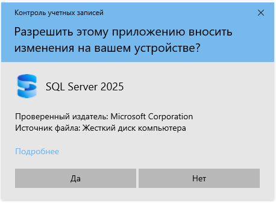

В окне «Выбор типа установки» нажмите на плитку Пользовательская (Custom).

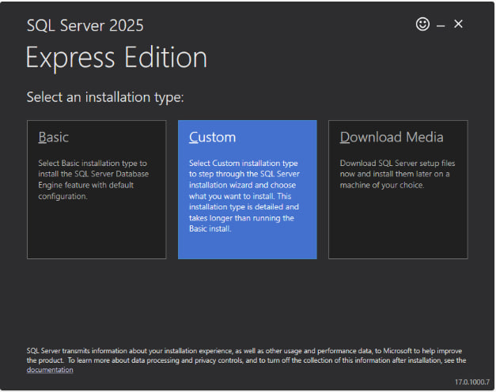

В следующем окне выберите каталог, в который будет скачен полный дистрибутив и язык. Нажмите Установить (Install).

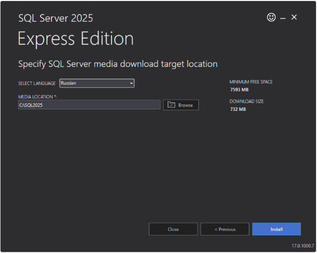

Программа скачает полные файлы установки и откроет «Центр установки SQL Server».

2. Выбор компонентов
В левом меню выберите Установка → Новая автономная установка SQL Server….

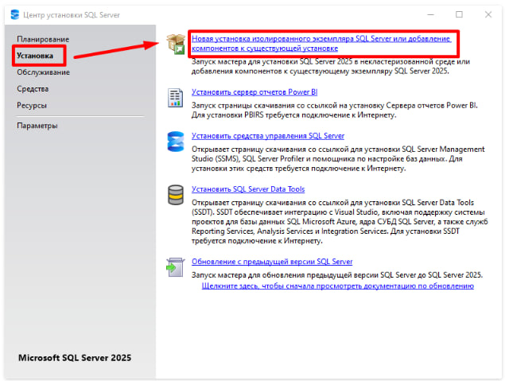

В окне Правила установки нажмите Далее

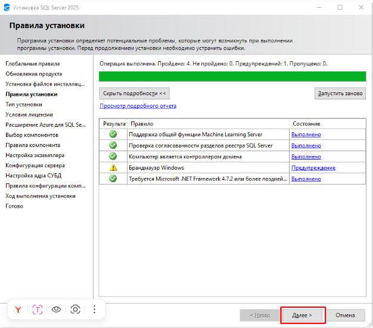

В окне Тип установки выберите Выполнить новую установку… и нажмите Далее

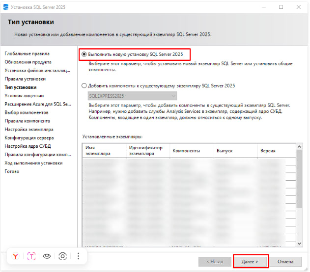

В окне Условия лицензии установите галку Я принимаю условия лицензии… и нажмите Далее

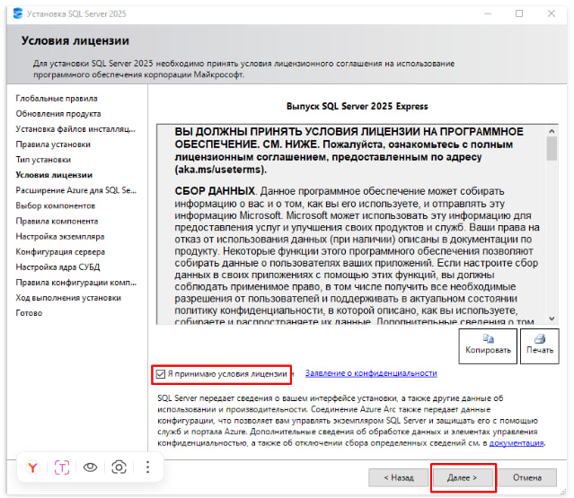

В окне Расширения Azure для SQL Server снимите галку Расширение Azure для SQL Server и нажмите Далее

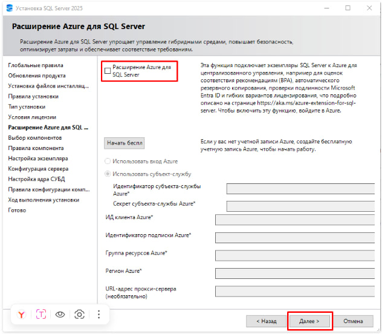

На этапе Выбор компонентов отметьте только Службы ядра СУБД, а все остальные флажки (репликации, службы машинного обучения и т.д.) снимите. Нажмите Далее.

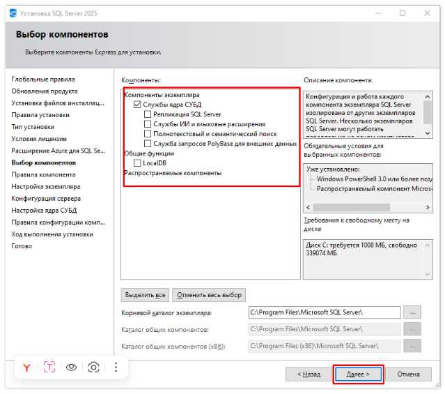

3. Настройка экземпляра
Для нашего случая (хранение данных АРГО):

Выберите Именованный экземпляр (Named instance).
Введите имя: ARGOGEO_P.
Поле Идентификатор экземпляра (Instance ID) обновится само.

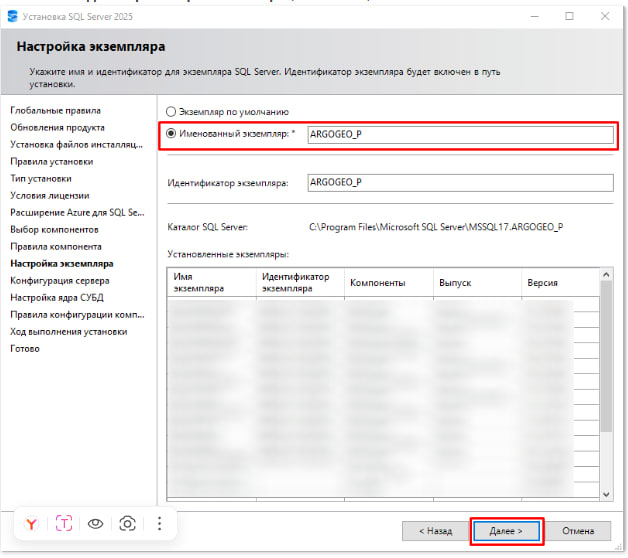

4. Конфигурация сервера
Убедитесь, что для службы Обозреватель SQL Server (SQL Server Browser) установлен тип запуска «Автоматически», если планируете подключаться к ARGOGEO_P по сети.

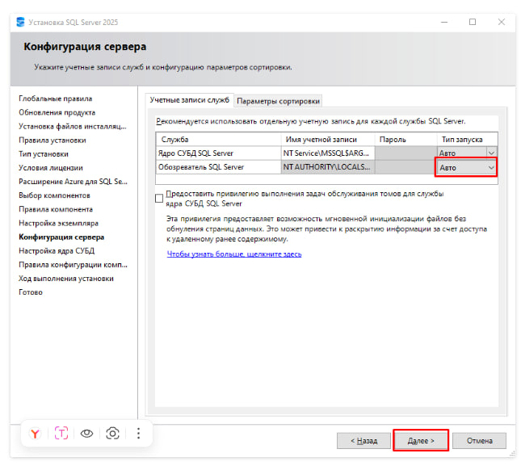

Настройка ядра СУБД: На вкладке Режим проверки подлинности выберите «Смешанный режим» (Mixed Mode) и задайте пароль для администратора.

Обязательно нажмите кнопку Добавить текущего пользователя в нижней части окна.

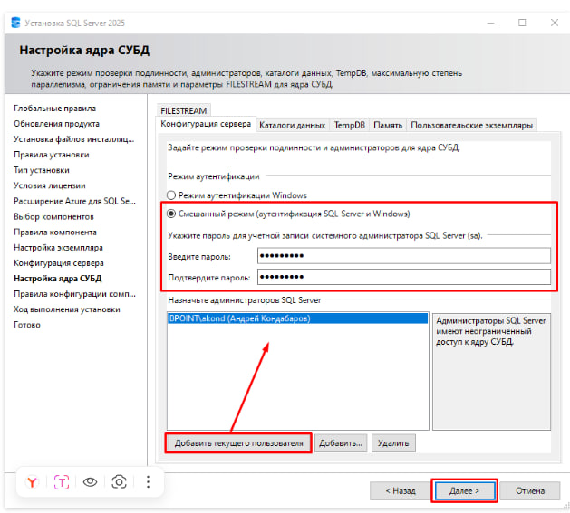

5. Завершение
Нажмите Установить и дождитесь окончания процесса.

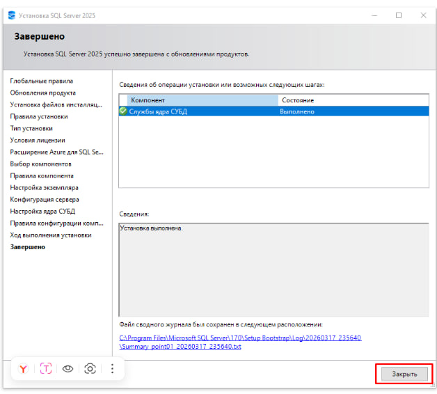

# Краткая шпаргалка

| Тема | Главное |
|---|---|
| СУБД | Microsoft SQL Server |
| Архитектура | Клиент-серверная |
| Язык | T-SQL |
| Страница | 8 КБ |
| Заголовок страницы | 96 байт |
| Extent | 8 страниц = 64 КБ |
| Основной файл | `.mdf` |
| Дополнительный файл | `.ndf` |
| Журнал транзакций | `.log` |
| Создание БД | `CREATE DATABASE` |
| Изменение БД | `ALTER DATABASE` |
| Удаление таблицы | `DROP TABLE` |
| Изменение таблицы | `ALTER TABLE` |
| Переменная | `DECLARE` |
| Присваивание | `SET`, `SELECT` |
| Вывод | `PRINT` |
| Преобразование типов | `CAST`, `CONVERT` |
| Условие | `IF`, `ELSE`, `CASE` |
| Цикл | `WHILE` |
| Обработка ошибок | `TRY/CATCH` |
| Ошибка | `RAISERROR` |
| Ожидание | `WAITFOR` |
| Курсор | `DECLARE → OPEN → FETCH → CLOSE → DEALLOCATE` |
| ID объекта | `OBJECT_ID` |
| Имя объекта | `OBJECT_NAME` |
| ID БД | `DB_ID` |
| Имя БД | `DB_NAME` |
| Системные объекты | `sys.objects`, `sys.columns`, `sys.database_principals` |

---

# Основные системные базы

```text
master   — основные сведения и конфигурация SQL Server
model    — шаблон для создания новых БД
msdb     — задания и связанные служебные данные
tempdb   — временные объекты и промежуточные данные
Resource — системные объекты SQL Server
```

---

# Основные команды T-SQL

```sql
-- Объявление переменной
DECLARE @value INT;

-- Присваивание
SET @value = 10;

-- Вывод
PRINT @value;

-- Преобразование
SELECT CAST(@value AS VARCHAR(10));

-- Условие
IF @value > 5
    PRINT 'OK';

-- Цикл
WHILE @value > 0
BEGIN
    SET @value = @value - 1;
END;

-- Обработка ошибок
BEGIN TRY
    -- код
END TRY
BEGIN CATCH
    -- обработка ошибки
END CATCH;
```

---

# Итог

**Microsoft SQL Server** — реляционная СУБД с клиент-серверной архитектурой, предназначенная для хранения, обработки и управления данными.

Для работы с SQL Server используется **T-SQL**, который позволяет:

- создавать и изменять базы данных;
- создавать и изменять объекты;
- работать с переменными;
- выполнять вычисления;
- обрабатывать строки и даты;
- использовать условия и циклы;
- обрабатывать ошибки;
- работать с курсорами;
- создавать хранимые процедуры, функции и триггеры.

Основу хранения данных составляют **базы данных, файлы, файловые группы, страницы и extents**, а для администрирования используются системные представления, функции и процедуры.
